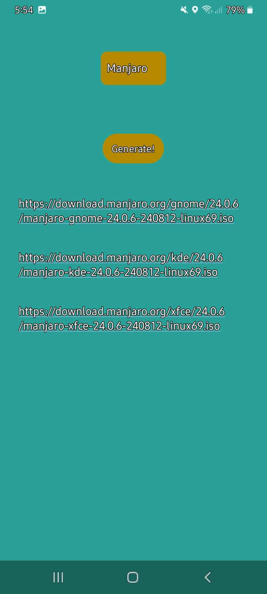
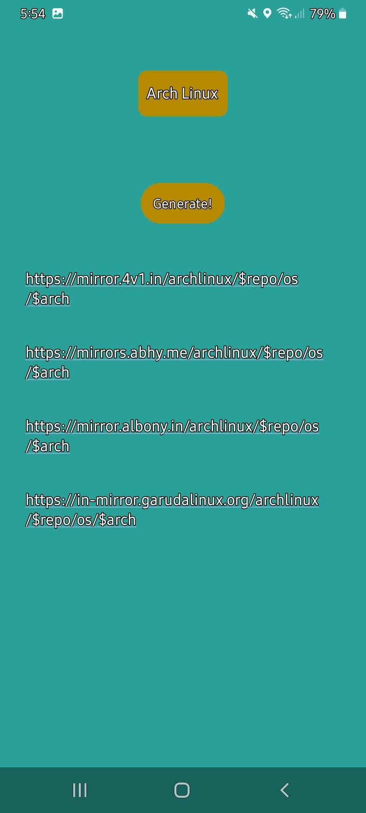

# Spinner Button TextView Android Project


## Table of Contents
- [Overview](#overview)
- [Features](#features)
- [Screenshots](#screenshots)
- [Installation](#installation)
- [Usage](#usage)
- [Contributing](#contributing)
- [License](#license)

## Overview

This Android project demonstrates the use of a Spinner, Button, and TextView to create an interactive user interface. The Spinner allows users to select an option from a dropdown list, and the Button updates the TextView based on the selected option.

## Features

- **Spinner**: A dropdown list for selecting an option.
- **Button**: Triggers an action based on the selected Spinner item.
- **TextView**: Displays the result or feedback to the user.

## Screenshots

### Main Screen


### Interaction Example


## Installation

1. **Clone the repository**:
   ```bash
   git clone https://github.com/your-username/your-repository-name.git
