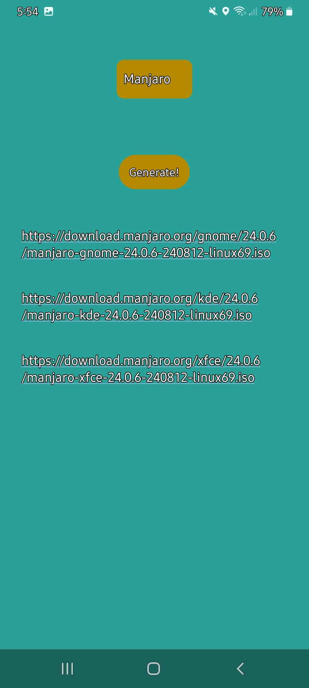
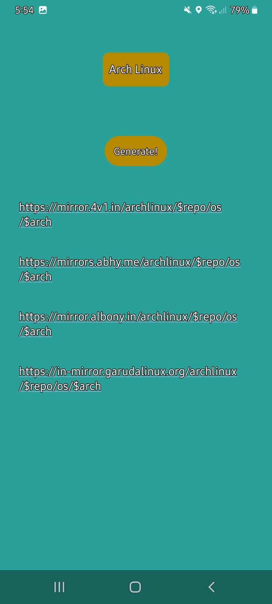

<h1 id="spinner-button-textview-android-project">Spinner Button TextView Android Project</h1>
<h2 id="table-of-contents">Table of Contents</h2>
<ul>
<li><a href="#overview">Overview</a></li>
<li><a href="#features">Features</a></li>
<li><a href="#screenshots">Screenshots</a></li>
<li><a href="#installation">Installation</a></li>
</ul>
<h2 id="overview">Overview</h2>

This Android project demonstrates the use of a Spinner, Button, and TextView to create an interactive user interface. The Spinner allows users to select a Linux distribution from a dropdown list, and the Button generates the TextView for the download link based on the selected Linux distro.

<h2 id="features">Features</h2>
<ul>
<li><strong>Spinner</strong>: A dropdown list for selecting a distribution of Linux.</li>
<li><strong>Button</strong>: Generate the download link based on the selected Linux distro.</li>
<li><strong>TextView</strong>: Displays the download link for the selected Linux distro.</li>
</ul>
<h2 id="screenshots">Screenshots</h2>
<h3 id="main-screen">Main Screen</h3>

<h3 id="interaction-example">Interaction Example</h3>

<h2 id="installation">Installation</h2>
<ol>
<li><strong>Clone the repository</strong>:
<pre><code>git clone https://github.com/sudiptarathi2020/Android-Lab-Assignments.git</code></pre>
</ol>
