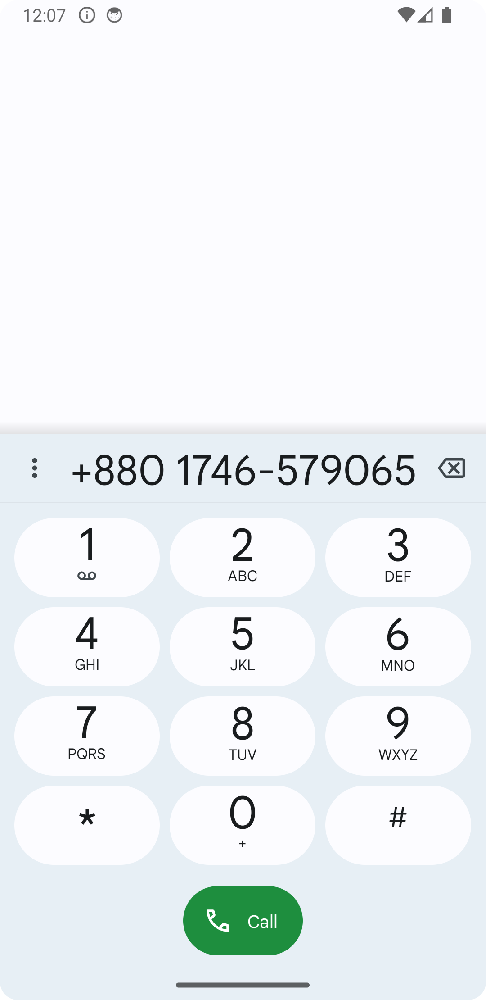

<h1 id="linux-distribution-info-app">Personalized Visiting Card App</h1>
<h2 id="table-of-contents">Table of Contents</h2>
<ul>
<li><a href="#overview">Overview</a></li>
<li><a href="#screenshots">Screenshots</a></li>
<li><a href="#installation">Installation</a></li>
</ul>
<h2 id="overview">Overview</h2>

This android app demonstrates the use of dual activity.In this app I created my visiting card.If I click on to my contact details it will redirect to respective apps for contacting with me.

<h2 id="features">Features</h2>
<h2 id="screenshots">Screenshots</h2>
<h3 id="main-screen-activity-1-input-">Main Screen (Activity 1 - Input)</h3>

<h3 id="linux-distribution-info-activity-2-display-">Linux Distribution Info (Activity 2 - Display)</h3>

<h2 id="installation">Installation</h2>

To run any project locally, follow these steps:

<ol>
  <li>Clone the repository:
    <pre><code>git clone https://github.com/sudiptarathi2020/Android-Lab-Assignments.git</code></pre>
  </li>
  <li>Open Android Studio and select <strong>File &gt; Open</strong>.</li>
  <li>Navigate to the project directory and open it.</li>
</ol>
